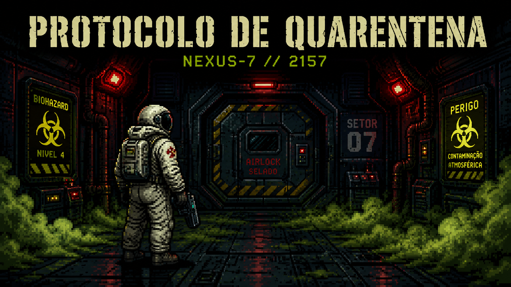

# 🚀 Protocolo de Quarentena



**Ano 2157. Estação Espacial NEXUS-7. Órbita de Europa.**  
Você acorda sozinho. As luzes estão vermelhas. A tripulação sumiu.  
E uma mensagem em loop ecoa pelos corredores:

> *"Protocolo de Quarentena ativado. Fique onde está."*

Visual Novel de ficção científica e suspense desenvolvida em **C puro (C11)**  
como projeto final da disciplina de Estruturas de Dados.

---

## 🎮 O Problema que o Sistema Resolve

O jogo precisa gerenciar três desafios técnicos simultaneamente:

- **Navegação não-linear** — o jogador toma decisões que alteram
  o caminho da história, podendo voltar atrás a qualquer momento
- **Enciclopédia dinâmica** — termos e personagens são descobertos
  durante a exploração e ficam disponíveis para consulta em ordem
  alfabética
- **Persistência de sessão** — o progresso é salvo e restaurado
  entre execuções, reconstruindo exatamente o estado anterior

---

## 🧱 Estruturas de Dados

### Pilha — Histórico de Navegação

A mecânica de **"Voltar à cena anterior"** exige uma estrutura
LIFO (Last In, First Out): a última cena visitada deve ser a
primeira a ser desfeita. A Pilha modela esse comportamento
com precisão semântica.

> Uma lista simples armazenaria os dados, mas não expressaria
> a semântica de "desfazer". A Pilha torna a intenção explícita
> no próprio código.

Implementação própria com nós encadeados e `malloc`/`free`.  
Arquivos: `pilha.h` / `pilha.c`

---

### Árvore Binária de Busca (BST) — Códex de Termos

O Códex é uma enciclopédia de termos desbloqueados durante
o jogo (`ARIA`, `Vírus XR-7`, `Protocolo Lazarus`...).
O jogador consulta esses termos em ordem alfabética a qualquer
momento.

A BST organiza os termos **automaticamente em ordem alfabética**
durante a inserção, sem ordenação posterior. A busca percorre
apenas um ramo da árvore a cada comparação — eficiente por
natureza.

> Um array exigiria ordenação manual a cada inserção.
> A BST resolve isso estruturalmente.

Implementação própria com nós encadeados e `malloc`/`free`.  
Arquivos: `bst.h` / `bst.c`

---

## 💾 Formato do Arquivo de Persistência

O progresso é salvo em `save.csv` — texto simples com campos
separados por ponto e vírgula.

**Por que CSV?**  
Legível por humanos, fácil de parsear em C puro com `strtok`
e sem necessidade de bibliotecas externas.

| Linha        | Conteúdo                                        |
|--------------|-------------------------------------------------|
| `cena_atual` | ID da cena onde o jogador estava ao salvar      |
| `historico`  | IDs da pilha do topo para a base                |
| `codex`      | Termos do Códex em ordem alfabética             |

**Casos de borda tratados:**
- Arquivo inexistente → inicia jogo novo normalmente
- Pilha vazia ao salvar → linha `historico` sem valores
- Códex vazio ao salvar → linha `codex` sem valores

---

## ⚠️ Limitações Conhecidas

- Texto sem acentos — o terminal CMD do Windows tem limitações
  com caracteres UTF-8, então optamos por texto sem acentuação
- Número de cenas fixo em 12 — expandir requer alterar a
  constante `TOTAL_CENAS` em `jogo.h`
- Descrições do Códex são genéricas — uma versão futura poderia
  ter descrições únicas por termo descoberto
- Sem sistema de conquistas ou múltiplos perfis de save

---

## 🗂️ Estrutura do Projeto
protocolo_quarentena/
│
├── main.c         — Menu inicial, cenas e loop principal
├── jogo.h / .c    — Lógica do jogo e estado do jogador
├── pilha.h / .c   — Estrutura de dados Pilha
├── bst.h / .c     — Estrutura de dados BST
├── salvar.h / .c  — Persistência em save.csv
├── utils.h / .c   — Utilitários de tela e animação
└── save.csv       — Gerado automaticamente ao salvar

---

## ⚙️ Como Compilar e Rodar

```bash
gcc -std=c11 -Wall main.c utils.c pilha.c bst.c jogo.c salvar.c -o protocolo_quarentena.exe
```

```bash
./protocolo_quarentena.exe
```

**Requisitos:** GCC 13+ com suporte a C11.  
**Testado em:** Windows 11 com MSYS2/MinGW GCC 13.2.0

---

*Projeto Final — Disciplina de Estruturas de Dados — 2026*
